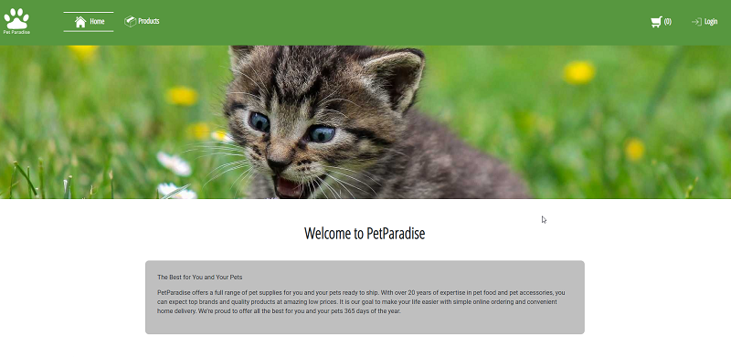

# Pet Paradise



A simple e-shop project

## Description

It is an online store that uses strapi hosted on heroku as backend.

- HTML/CSS/JS
- Bootstrap
- SASS
- JS components
- Strapi hosted on heroku and configured to save the images to cloudinary when uploaded through strapi
- Add product and upload images to cloudinary and add the url to strapi and the Database

## Built With

- [HTML](https://developer.mozilla.org/en-US/docs/Web/HTML)
- [CSS](https://www.w3.org/Style/CSS/Overview.en.html)
- [JavaScript](https://www.javascript.com/)
- [Boostrap](https://getbootstrap.com/)
- [SASS](https://sass-lang.com/)

## Getting Started

### Installing

Clone the repo:

```bash
git clone git@github.com:kronosGR/Georgios-Katsanakis-semester-project-2.git
```

### Running

1. Installing **live server**

```bash
npm install live-server

```

2. Running live-server

```bash
live-server
```

## Notes

### Strapi configuration for heroku and cloudinary

```
# install strapi-provider-upload-cloudinary
npm i strapi-provider-upload-cloudinary

# create a config file at ./config/plugins.js
module.exports = ({ env }) => ({
  // ...
  upload: {
    provider: 'cloudinary',
    providerOptions: {
      cloud_name: env('CLOUDINARY_NAME'),
      api_key: env('CLOUDINARY_KEY'),
      api_secret: env('CLOUDINARY_SECRET'),
    },
    actionOptions: {
      upload: {},
      delete: {},
    },
  },
  // ...
});

# set variables to heroku
heroku config:set CLOUDINARY_NAME=cloud_name
heroku config:set CLOUDINARY_KEY=api_key
heroku config:set CLOUDINARY_SECRET=api_secret
```

## Contact

Contact me through the following links.

[My LinkedIn page](https://www.linkedin.com/in/kronosgr/)
